# Camera_Raider

A Ruby on Rails 4 system to watch a lot of security cameras with a lot of shots at the same time. Like a TV-Wall but for security IP cameras with a central FTP server collecting a shot from each camera each minute or so.

Did I tell it's 1000% responsive? And if you are using an iPhone/Android/iPad you can without issues, even when you connect to the live feed from the camera? And that the logo is SVG that changes when you move down with lovely animation?

## General Scenario

So imagine this. You have 100+ stores and you want to monitor them with cameras, but don't want to spend zillions doing that. So you buy 100+ IP Cameras like this one at Amazon and install them in your stores: 

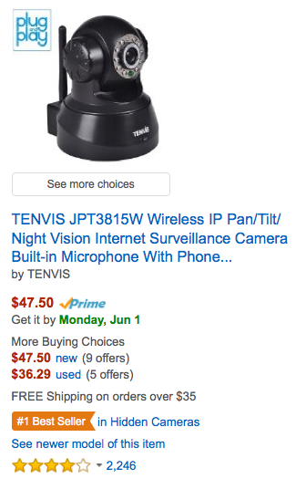

Then you install a central FTP server with a user/folder for each camera, and you configure the cameras so they place a shot in that central server each 1/5/10 minutes. You also set a DynDNS on the camera, and open a port to watch the live feed using a browser. Those functions, protocols and ports are pretty standard for all those kind of IP Cameras. 

And finally, you install this app. 

## Install

First, create a MySql server and create a database there called "cameras". You can use Sqlite, PG or whatever you want, just change the config/db.yml and check the users and passwords for that. 

```
bundle install
rake db:migrate
rake db:seed
rails s

Login as:
User: user@example.com
Pass: changeme
```

## Post Install

You will have to add some cameras to the Cameras table. Each store or location must have a number. A single store can have multiple cameras, just add them to the table.

The setup the robot. The robot take the FTP public folder and check all the folders there. Each folder is a camera, and the name of the folder must be the number of the store, right justified with zeros, then dash and then the number of the camera. 

Ej. For the store 8, camera 3, the folder would be: 008-3.

The robot is in the folder called "camera_linker", and you should setup the source folder (the FTP public folder) and the target folder (the Public forlder of the Rails project). This robot create 2 stills of each shot, one high resolution and one low resolution, in to different folders, and rename each file with the timestamp so you know when the shot was taken.

Finally, set a cron job to execute the robot each 1-5-10 minutes. 

## Gems Used

* Rails 4.2 (duh)
* Devise for Auth
* ActiveAdmin
* Bootstrap 3
* A pretty theme from WrapBootrap that I bought [here](http://demo.fuviz.com/reen/v1-1/portfolio5.html).

## Screenshots!

So you want to see it before you install anything? I understand. Here are some screenshots of the 3 main screens (index, store detail and store camerashot detail), plus the Cameras CRUD and the Users Admin dashboard.

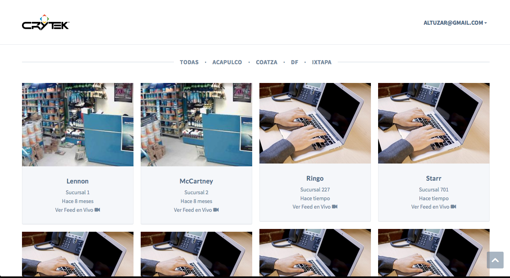
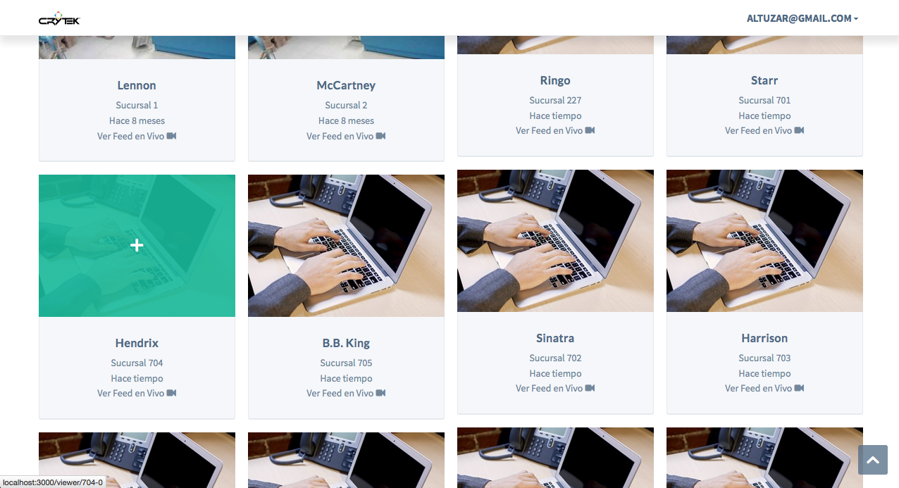
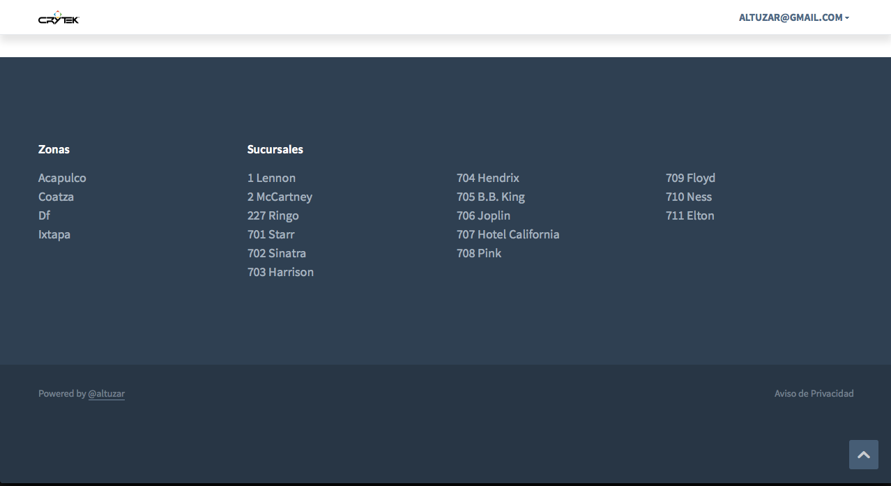
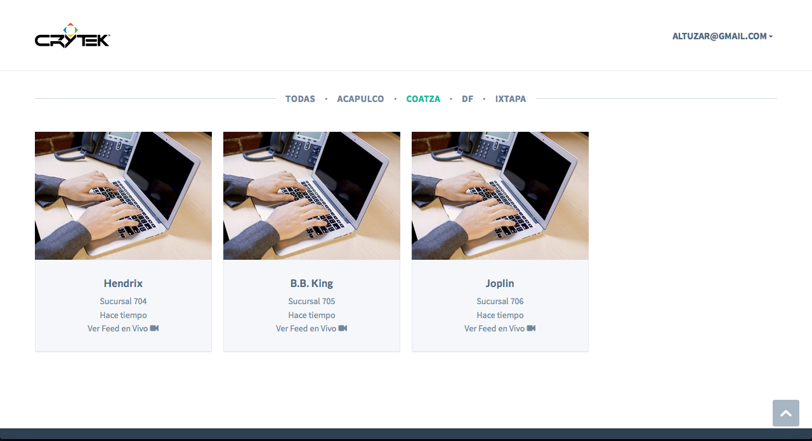
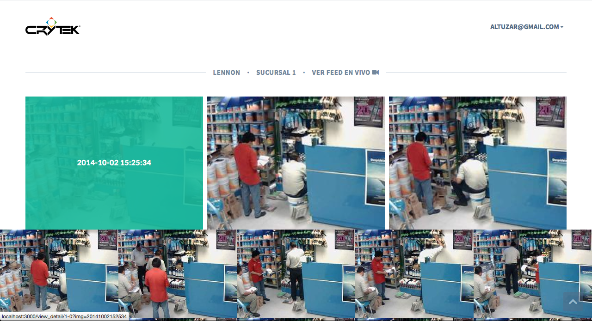
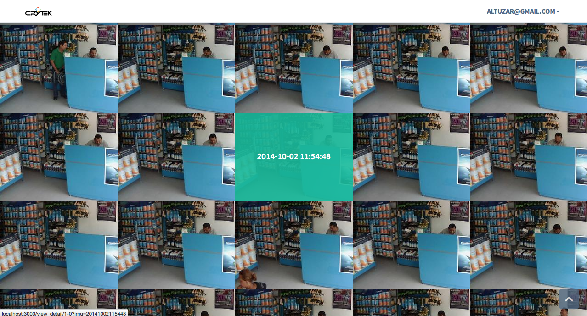
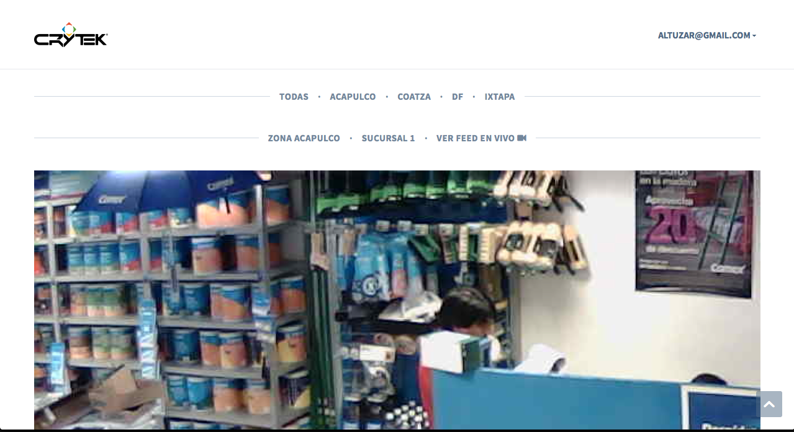
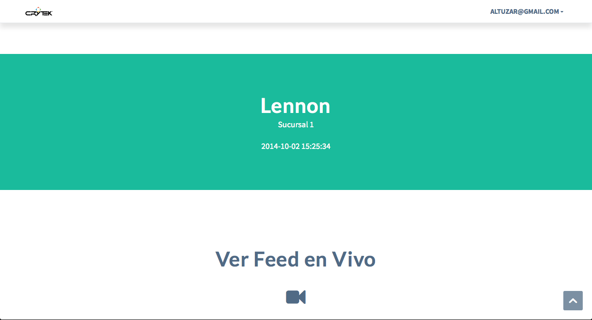
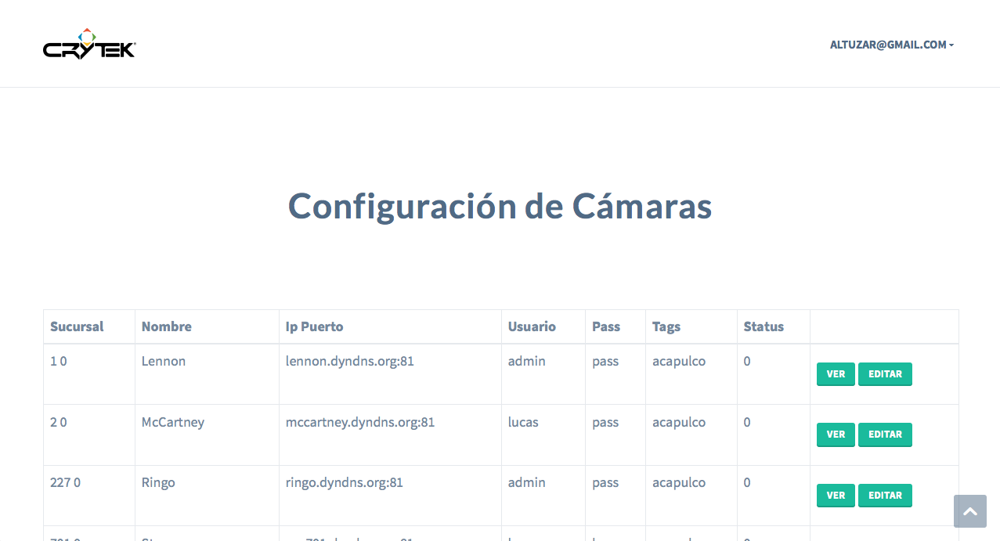
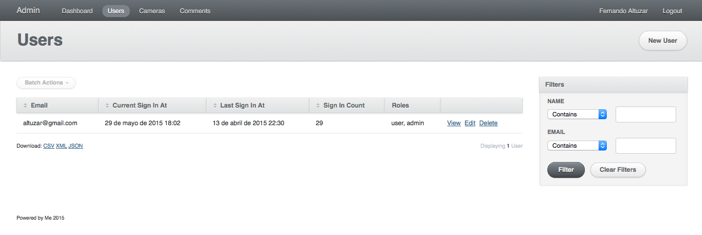

\o/

## Licence

MIT!
